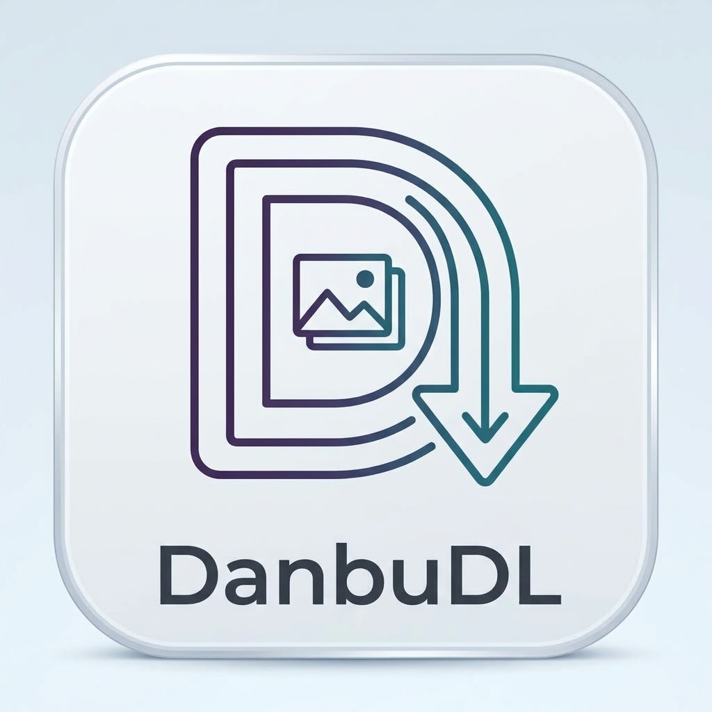
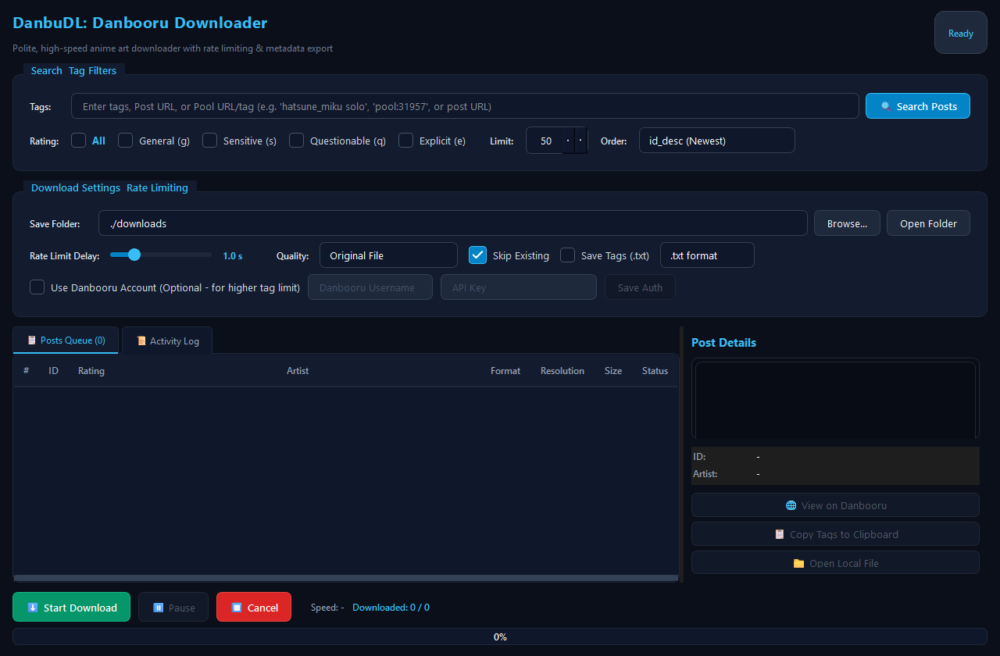

<div align="left">



# DanbuDL: Danbooru Downloader

[](https://www.python.org/downloads/)
[](https://pypi.org/project/PyQt6/)
[](LICENSE)
[](https://github.com/kjanard/DanbuDL)

โปรแกรม Desktop GUI สำหรับค้นหาและดาวน์โหลดรูปภาพจาก **Danbooru** (https://danbooru.donmai.us/) พัฒนาด้วย **Python** และ **PyQt6** พร้อมดีไซน์ Dark Mode ที่สวยงามและฟีเจอร์ครบครัน

[🛡️ API Compliance](#api-compliance) • [✨ ฟีเจอร์หลัก](#key-features) • [🚀 การติดตั้ง](#installation) • [📖 คู่มือการใช้งาน](#usage-guide) • [📁 โครงสร้างโปรเจกต์](#project-structure) • [Changelog](CHANGELOG.md) • [License](LICENSE)

---
</div>

<div align="center">
  
</div>

<br/>

> [!NOTE]
> **🛡️ ได้รับการออกแบบตามมาตรฐานทางการของ Danbooru API (Official Compliance)**:  
> โปรแกรมนี้ได้รับการพัฒนาและออกแบบอย่างเคร่งครัดตามข้อกำหนดและแนวทางปฏิบัติทางการของ Danbooru จาก [Help:API](https://danbooru.donmai.us/wiki_pages/help:api) และ [Help:User Scripts](https://danbooru.donmai.us/wiki_pages/help:user_scripts) เพื่อให้มั่นใจในความปลอดภัยต่อบัญชีผู้ใช้ หลีกเลี่ยงการถูกแบน IP และลดภาระการทำงานของเซิร์ฟเวอร์ Danbooru

---

## 🛡️ การปฏิบัติตามมาตรฐาน Danbooru API (API Compliance) <a id="api-compliance"></a>

โปรแกรมนี้ปฏิบัติตามข้อกำหนดและ Best Practices ของระบบ Danbooru อย่างครบถ้วน:

1. **การระบุตัวตนผ่าน User-Agent (Identification Standard)**:
   - ส่ง Header `User-Agent` ในรูปแบบที่เป็นมาตรฐานเฉพาะตัว เช่น `DanbuDownloader/1.2 (user: <username>)` ไม่ปลอมแปลงเป็น Web Browser ตามกฎระเบียบของ Danbooru
2. **ระบบควบคุมอัตราคำขออย่างสุภาพ (Thread-safe Rate Limiting & Backoff)**:
   - ควบคุมการส่งคำขอให้อยู่ในอัตราที่เหมาะสม (~1 คำขอต่อวินาที) ป้องกันการยิงคำขอถี่เกินไปด้วย `threading.Lock()` ข้ามเธรด
   - กำหนดค่า Safe Minimum Delay ขั้นต่ำไว้ที่ 0.5s เพื่อป้องกันข้อผิดพลาด `HTTP 429 User Throttled`
   - รองรับการตรวจสอบ Header `x-rate-limit` และมีระบบ **Exponential Backoff & Retry** อัตโนมัติเมื่อชนขีดจำกัด
3. **ระบบแคชและชะลอการส่งคำขอ (Smart Autocomplete Caching & Debounce)**:
   - หน่วงเวลา Debounce ของระบบแนะนำแท็กอัตโนมัติ (Autocomplete) ไว้ที่ 450ms เพื่อรอให้ผู้ใช้พิมพ์เสร็จก่อนส่งคำขอ
   - มีระบบแคช In-Memory ในตัว ป้องกันการส่งคำขอซ้ำซ้อนไปยัง Danbooru เมื่อพิมพ์หรือลบคำเดิม
4. **ระบบแบ่งหน้าแบบ Cursor Pagination (`page=b<id>`)**:
   - ใช้การแบ่งหน้าด้วย Cursor (`page=b{post_id}`) แทนการใช้เลขหน้าแบบดั้งเดิมตามคำแนะนำของ Danbooru ซึ่งช่วยให้สามารถดึงข้อมูลจำนวนมากได้อย่างต่อเนื่องโดยไม่พบปัญหาข้อผิดพลาด `HTTP 410 Gone` (ข้อจำกัด 1,000 หน้า)
5. **ความปลอดภัยในการยืนยันตัวตน (HTTP Basic Authentication)**:
   - ใช้มาตรฐาน **HTTP Basic Authentication** (RFC 7617) ผ่าน Request Header เพื่อความปลอดภัย หลีกเลี่ยงการส่ง API Key ผ่าน URL Query Parameter
6. **การใช้ Endpoint แบบกลุ่มอย่างมีประสิทธิภาพ (Batch Endpoints)**:
   - ใช้งาน Endpoint รวม เช่น การค้นหาผ่านแท็กชุด (`tags=pool:...` หรือ `tags=id:...`) หลีกเลี่ยงการส่งคำขอแบบ Sequential ID Scan ทีละภาพ เพื่อประหยัด Bandwidth และทรัพยากรของเซิร์ฟเวอร์

---

## ✨ ฟีเจอร์หลัก (Key Features) <a id="key-features"></a>

1. **Tag, Post URL & Pool Search**:
   - ค้นหารูปภาพด้วยแท็ก พร้อมระบบแนะนำแท็กอัตโนมัติ (Autocomplete) พร้อมสีแยกหมวดหมู่ (Artist, Character, Copyright, General) และ In-memory Cache
   - รองรับการวางลิงก์โพสต์เดี่ยว (เช่น `https://danbooru.donmai.us/posts/12345`)
   - รองรับการดาวน์โหลดทั้งชุด **Danbooru Pools** โดยวาง URL หรือพิมพ์ `pool:31957` (เหมาะสำหรับดาวน์โหลดเซ็ตผลงานหรือตอนมังงะ)
2. **ระบบ Cursor Pagination (`page=b<id>`) ตามมาตรฐาน Danbooru**:
   - ดึงข้อมูลโพสต์ต่อเนื่องได้ไม่จำกัดโดยไม่ติด Error `410 Gone`
3. **ตัวกรอง Rating ครบทุกระดับ พร้อมปุ่ม "All"**:
   - ตัวเลือก **All**: เลือก/ปลดเลือกทุกระดับได้ในคลิกเดียว พร้อมระบบตรวจจับและซิงค์สถานะอัตโนมัติ
   - เลือกระดับเฉพาะเจาะจง: **General (g)**, **Sensitive (s)**, **Questionable (q)**, **Explicit (e)**
4. **ระบบความปลอดภัยและการระบุตัวตน**:
   - ส่ง User-Agent ถูกต้องตามข้อกำหนด และรองรับ HTTP Basic Authentication
   - ปรับระยะเวลาหน่วงคำขอ (Request Delay) ได้ 0.5s - 3.0s (ค่าเริ่มต้น 1.0s ปลอดภัยต่อบัญชี)
   - ระบบ Exponential Backoff อัตโนมัติเมื่อเจอรหัส `429 User Throttled` หรือปัญหาเครือข่าย
   - ล็อคป้องกันการส่งคำขอซ้ำซ้อนขณะกำลังดาวน์โหลดหรือค้นหา (Concurrency Guard)
5. **Live Image Preview & Metadata Panel**:
   - พรีวิวรูปภาพและแสดงข้อมูลแบบละเอียด (Post ID, Rating, Artist, Resolution, Size, Score, Tags)
   - มีปุ่มเปิดดูบนเว็บ Danbooru และคัดลอก Tags ทั้งหมดลงคลิปบอร์ดได้ทันที
   - ปุ่มเปิดดูไฟล์รูปในเครื่องหลังจากดาวน์โหลดเสร็จ
6. **บันทึก Metadata คู่กับรูปภาพ**:
   - บันทึกไฟล์ `.txt` สำหรับนำไปใช้เทรน AI (LoRA / Stable Diffusion) หรือ `.json` เก็บข้อมูลเต็มรูปแบบ
7. **จัดการคิวดาวน์โหลดอัจฉริยะ**:
   - ระบบข้ามไฟล์ที่เคยดาวน์โหลดแล้ว (Skip Existing)
   - ปุ่มควบคุมการดาวน์โหลด: **Start**, **Pause / Resume**, **Cancel**
   - แสดงความคืบหน้า (%) และความเร็วดาวน์โหลดแบบ Real-time
8. **รองรับ Danbooru Account (Optional)**:
   - สามารถกรอก Username & API Key เพื่อเพิ่มโควตาแท็กและสิทธิการเข้าถึงของบัญชีคุณ

---

## 🚀 การติดตั้งและเริ่มใช้งาน (Installation & Quick Start) <a id="installation"></a>

### 📋 ข้อกำหนดของระบบ (Prerequisites)
* **Python**: เวอร์ชัน `3.10` ขึ้นไป (ทดสอบกับ Python 3.10, 3.11, 3.12)
* **Git**: สำหรับโคลนโค้ดจาก GitHub
* **ระบบปฏิบัติการ**: Windows 10/11 (หรือ macOS / Linux ที่รองรับ PyQt6)

### 📦 ขั้นตอนการติดตั้ง (Step-by-Step Installation)

#### 1. โคลน Repository
เปิด Terminal หรือ PowerShell แล้วรันคำสั่ง:
```bash
git clone https://github.com/kjanard/DanbuDL.git
cd DanbuDL
```

#### 2. สร้างและเปิดใช้งาน Virtual Environment (แนะนำ)
เพื่อป้องกันไม่ให้ไลบรารีไปกระทบกับแพ็กเกจส่วนกลางในระบบของคุณ:
* **Windows (PowerShell / Command Prompt)**:
  ```powershell
  python -m venv .venv
  .venv\Scripts\activate
  ```
* **macOS / Linux**:
  ```bash
  python3 -m venv .venv
  source .venv/bin/activate
  ```

#### 3. ติดตั้ง Dependencies
ติดตั้งไลบรารีที่จำเป็นทั้งหมด:
```bash
pip install -r requirements.txt
```

#### 4. เริ่มใช้งานโปรแกรม (Run Application)
```bash
python main.py
```

#### 5. รัน Automated Test Suite (ทางเลือก - ตรวจสอบความสมบูรณ์ของระบบ)
ทดสอบระบบทั้งหมด 27 รายการ (Danbooru API, Rate Limiter, Config, Downloader, UI Handlers):
```bash
python -m unittest discover -s tests -p "test_*.py" -v
```

---

## 📖 คู่มือการใช้งาน (Usage Guide) <a id="usage-guide"></a>

### 1. 🔍 การค้นหาด้วยแท็ก (Tag Search & Autocomplete)
* พิมพ์แท็กที่ต้องการค้นหาในช่อง **Tags / Pool URL / Post URL** เช่น `hatsune_miku`, `blue_archive`, `1girl`
* **ระบบแนะนำแท็กอัจฉริยะ (Autocomplete)**:
  * มีระบบ Debounce 450ms และ In-Memory Cache ป้องกันการส่งคำขอซ้ำซ้อน
  * แสดงสีแยกตามประเภทแท็ก Danbooru มาตรฐาน:
    * 🟣 **Artist** (ศิลปิน / นักวาด)
    * 🟢 **Character** (ตัวละคร)
    * 🔴 **Copyright** (ซีรีส์ / อนิเมะ / เกม)
    * 🔵 **General** (ลักษณะภาพ / เสื้อผ้า / องค์ประกอบ)
* สามารถเว้นวรรคเพื่อพิมพ์แท็กเพิ่มเติม *(หมายเหตุ: Danbooru อนุญาตให้ค้นหาพร้อมกันสูงสุด 2 แท็กสำหรับบัญชีผู้ใช้ทั่วไป)*

### 2. 📚 การดาวน์โหลดทั้งชุดอัลบั้ม (Danbooru Pools)
* หากต้องการดาวน์โหลดชุดภาพผลงาน อาร์ตบุ๊ก หรือมังงะครบทุกภาพในตอน:
  * วางลิงก์หน้า Pool ลงในช่องค้นหาได้ทันที เช่น:
    ```text
    https://danbooru.donmai.us/pools/31957
    ```
  * หรือพิมพ์รูปแบบแท็ก `pool:31957` แล้วกด **ค้นหา**
* ระบบจะทำการดึงรายชื่อภาพทั้งหมดใน Pool นั้นเข้าสู่คิวดาวน์โหลดทันที

### 3. 🖼️ การดาวน์โหลดภาพเดี่ยว (Direct Post URL)
* สามารถวางลิงก์หน้ารูปภาพเฉพาะเจาะจงได้โดยตรง เช่น:
  ```text
  https://danbooru.donmai.us/posts/8512345
  ```
* โปรแกรมจะดึงข้อมูลรูปภาพและพรีวิวขึ้นมาให้ตรวจสอบและดาวน์โหลดทันที

### 4. 🎯 การกรองระดับเนื้อหา (Content Rating Filters)
* เลือกระดับความเหมาะสมของภาพที่ต้องการค้นหา:
  * **All**: ปุ่มสลับเลือก/ปลดเลือกทุกระดับในคลิกเดียว พร้อมระบบตรวจจับสถานะอัตโนมัติ
  * **General (g)**: ภาพทั่วไป ปลอดภัย เหมาะกับทุกวัย (SFW)
  * **Sensitive (s)**: ภาพเซ็กซี่ วาบหวิว หรือชุดว่ายน้ำ
  * **Questionable (q)**: ภาพล่อแหลม สื่อไปในทางเพศ
  * **Explicit (e)**: ภาพเนื้อหาสำหรับผู้ใหญ่ (NSFW / 18+)

### 5. 🤖 การเก็บ Metadata สำหรับเทรน AI (LoRA / Stable Diffusion)
* ในแผงตั้งค่าและคิวดาวน์โหลด:
  * ติ๊กถูกที่ **Save Metadata** เพื่อเปิดใช้งาน
  * เลือกฟอร์แมตไฟล์ Metadata:
    * **txt**: สร้างไฟล์ `.txt` ชื่อเดียวกับภาพ บรรจุแท็กทั้งหมดคั่นด้วยเครื่องหมายจุลภาค (Comma) พร้อมนำไปเป็น Caption สำหรับเทรนโมเดล LoRA, DreamBooth, Flux หรือ Stable Diffusion ได้ทันที
    * **json**: จัดเก็บ Metadata ฉบับเต็ม (Resolution, Artist, Character, Copyright, Score, Source URL)

### 6. ⚙️ การตั้งค่า Danbooru API (ทางเลือกเสริม)
* โดยค่าเริ่มต้น โปรแกรมสามารถใช้งานดาวน์โหลดได้ทันทีโดยไม่ต้องล็อกอิน
* หากคุณมีบัญชี Danbooru (เช่น ระดับ Gold หรือ Platinum ที่ได้รับสิทธิ์ค้นหาหลายแท็กพร้อมกัน):
  * สร้าง API Key ได้จาก [Danbooru User Profile -> API Key](https://danbooru.donmai.us/profile)
  * กรอก **Username** และ **API Key** ในหน้าต่างการตั้งค่า
  * โปรแกรมจะส่งข้อมูลยืนยันตัวตนผ่าน **HTTP Basic Authentication** ตามมาตรฐานความปลอดภัย RFC 7617

---

## 📁 โครงสร้างโปรเจกต์ (Project Structure) <a id="project-structure"></a>

```
DanbuDownloader/
├── assets/
│   ├── check.svg              # ไอคอน Vector Checkmark สำหรับ UI Checkbox
│   └── screenshot_initial.png # ภาพตัวอย่างหน้าจอโปรแกรมเริ่มต้น (Desktop UI)
├── icon/
│   ├── logo.jpg         # ไอคอนโลโก้ของโปรแกรม DanbuDL
│   └── logo2.jpg        # ภาพอาร์ตเวิร์กโลโก้ความละเอียดสูง
├── core/
│   ├── api.py           # Danbooru API client (Basic Auth, Cursor pagination, Rate limit)
│   ├── config.py        # การจัดการไฟล์ตั้งค่า (config.json)
│   └── downloader.py    # ระบบดาวน์โหลดแบบ Threaded (QThread, Metadata saver)
├── tests/
│   ├── test_api.py          # Unit tests สำหรับ Danbooru API client
│   ├── test_config.py       # Unit tests สำหรับ ConfigManager
│   ├── test_downloader.py   # Unit tests สำหรับ DownloadWorker & FetchWorker
│   ├── test_ui.py           # Unit tests สำหรับ PyQt6 UI & Event Handlers
│   └── test_integration.py  # Integration tests กับ Danbooru API แบบ Live
├── ui/
│   ├── main_window.py   # หน้าต่างหลักของโปรแกรม (GUI & Event Handlers)
│   ├── preview_panel.py # พาเนลพรีวิวภาพและรายละเอียด Metadata
│   ├── widgets.py       # Custom Widgets (Autocomplete LineEdit, Rating Badge)
│   └── styles.py        # ธีม Dark Mode (QSS)
├── main.py              # จุดเริ่มต้นโปรแกรม (Application Entry Point)
├── requirements.txt     # ไลบรารีที่จำเป็น
├── config.example.json  # ไฟล์ตัวอย่างการตั้งค่าเริ่มต้น
├── .gitignore           # กำหนดไฟล์ที่ไม่ต้องการนำขึ้น Git (ละเว้น config.json, แคช, ขยะ)
├── LICENSE              # สัญญาอนุญาตการใช้งานแบบ Non-Commercial & Share-Alike
├── CHANGELOG.md         # ประวัติการปรับปรุงเวอร์ชัน
└── README.md            # คู่มือการใช้งาน
```

---

## 📝 ประวัติการอัปเดต (Changelog) <a id="changelog"></a>

รายละเอียดการอัปเดตในแต่ละเวอร์ชัน สามารถอ่านเพิ่มเติมได้ที่ไฟล์ [CHANGELOG.md](CHANGELOG.md)
* **v1.2.0**: รีแบรนด์ชื่อแอปเป็น **DanbuDL: Danbooru Downloader**, เพิ่มโลโก้โปรเจกต์อย่างเป็นทางการ (`icon/`), เพิ่มสัญญาอนุญาต Custom NC-SA 1.0, เพิ่มตัวเลือก Rating "All", รองรับ Danbooru Pools/Post URLs, ปรับใช้ Cursor Pagination (`b<id>`), เพิ่มระบบป้องกัน 429 Throttling ด้วย Thread-Safe Rate Limiter และ Autocomplete In-Memory Cache (450ms Debounce), สร้าง Automated Test Suite ครบ 27 รายการ, จัดทำ `.gitignore` และคู่มือติดตั้ง-ใช้งานฉบับสมบูรณ์
* **v1.1.0**: ปรับปรุงการเชื่อมต่อตามข้อกำหนดทางการของ Danbooru API (User-Agent, HTTP Basic Auth, Exponential Backoff)
* **v1.0.0**: เปิดตัวโปรแกรม Danbooru Downloader พร้อม UI แบบ Dark Mode, Tag Autocomplete และระบบดาวน์โหลดแบบมัลติเธรด

---

## 🔮 แผนการพัฒนาในอนาคต (Future Plan / Roadmap) <a id="roadmap"></a>

รายการฟีเจอร์และแนวทางการต่อยอดที่วางแผนไว้สำหรับการพัฒนาในรุ่นถัดไป:

1. **🖼️ Grid Thumbnail Gallery View (โหมดแกลเลอรีภาพตัวอย่าง)**:
   - เพิ่มแท็บสลับมุมมองระหว่างตารางรายการ (Table View) กับตารางภาพขนาดย่อ (Thumbnail Grid) เพื่อให้สามารถกวาดสายตาดูตัวอย่างภาพทั้งหมดได้อย่างสะดวกและรวดเร็ว
2. **🖱️ Right-Click Context Menu (เมนูคลิกขวาในคิวรายการ)**:
   - เพิ่มเมนูลัดเมื่อคลิกขวาที่รายการโพสต์ เช่น *ดาวน์โหลดเฉพาะรูปนี้*, *คัดลอก Post ID/URL*, *คัดลอกแท็กศิลปิน*, หรือ *ลบรูปนี้ออกจากคิว*
3. **📦 Standalone Portable Executable (`.exe`)**:
   - รวมแพ็กเกจด้วย PyInstaller ให้เป็นไฟล์เดี่ยว `.exe` พร้อมไอคอนแอปพลิเคชัน เพื่อให้เปิดใช้งานบนระบบปฏิบัติการ Windows ได้ทันทีโดยไม่ต้องติดตั้ง Python หรือไลบรารีเสริม
4. **🔍 Advanced Search Filters (ตัวกรองขั้นสูง)**:
   - เพิ่มตัวกรองความละเอียดภาพขั้นต่ำ (Min Width / Height), กำหนดช่วงคะแนน (Score Range), และเลือกกรองนามสกุลไฟล์เฉพาะ (`jpg`, `png`, `gif`, `mp4`, `webm`)
5. **🏷️ Custom Tag Blacklist / Exclude System**:
   - ระบบเพิ่มแท็กที่ไม่ต้องการเห็นหรือไม่ต้องการดาวน์โหลด (Negative tags / Blacklist) ลงในหมวดตั้งค่าส่วนกลาง

---

## 📜 สัญญาอนุญาต (License) <a id="license"></a>

โปรเจกต์นี้เผยแพร่ภายใต้สัญญาอนุญาต **Custom Non-Commercial & Share-Alike License (NC-SA 1.0)** — สามารถอ่านรายละเอียดข้อกำหนดฉบับเต็มได้ที่ไฟล์ [LICENSE](LICENSE)

* 🟢 **ใช้งานส่วนบุคคลและการศึกษาได้ฟรี (Free for Personal & Educational Use)**: อนุญาตให้ศึกษา ใช้งาน ดัดแปลง และแจกจ่ายต่อได้ฟรีเพื่อประโยชน์ส่วนบุคคลหรือการศึกษาโดยไม่มีค่าใช้จ่าย
* 🚫 **ห้ามนำไปใช้ในเชิงพาณิชย์ (No Commercial Use)**: ไม่อนุญาตให้นำโค้ดหรือส่วนใดส่วนหนึ่งของโปรแกรมไปจำหน่าย ให้เช่า แสวงหารายได้ หรือรวมเข้ากับซอฟต์แวร์เชิงพาณิชย์/แบบปิด (Closed-source) โดยไม่ได้รับความยินยอมเป็นลายลักษณ์อักษร
* 🔄 **ส่งต่อภายใต้สัญญาเดียวกัน (Share-Alike)**: การดัดแปลงหรือต่อยอดโปรเจกต์นี้ จะต้องเปิดเผยซอร์สโค้ดและเผยแพร่ภายใต้สัญญาอนุญาตแบบเดียวกันเสมอ (Open Source Only)


